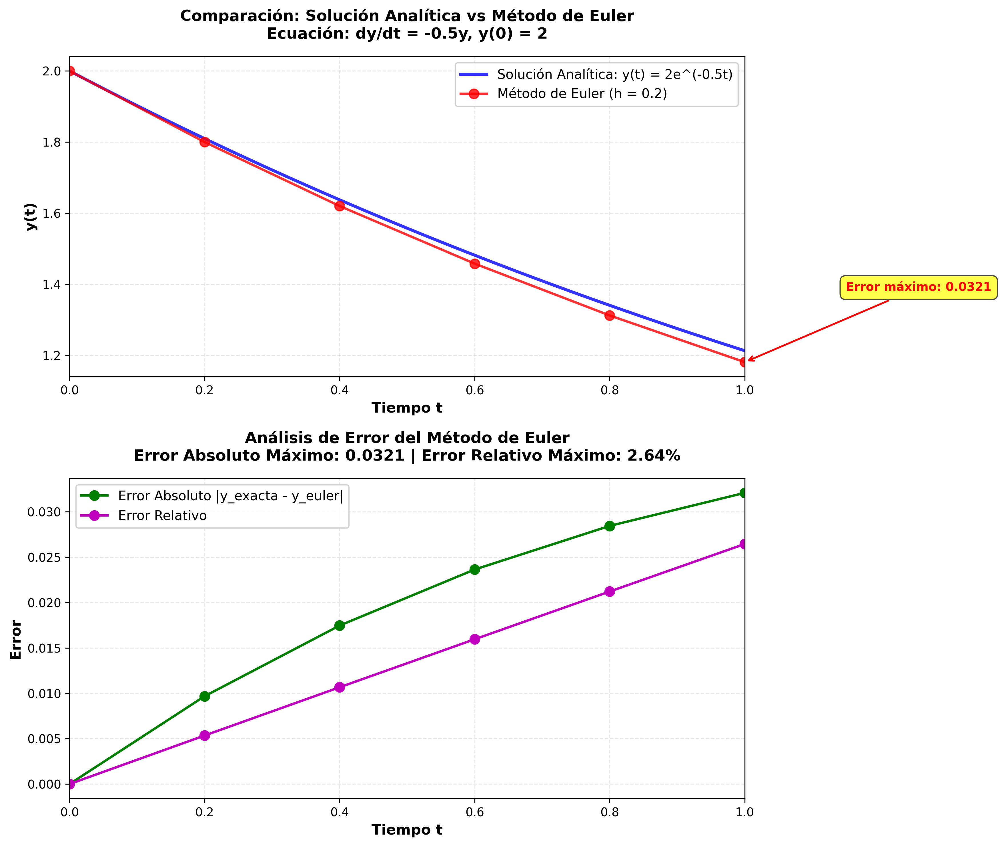

# Ecuación Diferencial Separable: Comparación Método Analítico vs Euler

## 📋 Descripción del Proyecto

Este proyecto resuelve una **ecuación diferencial ordinaria (EDO) separable** utilizando dos enfoques diferentes:

1. **Método Analítico**: Solución exacta mediante separación de variables
2. **Método de Euler**: Aproximación numérica con análisis de error

El objetivo es comparar ambas soluciones y analizar la precisión del método numérico.

---

## 🎯 Problema Matemático

### Ecuación Diferencial

```
dy/dt = -0.5 × y
```

con condición inicial:

```
y(0) = 2
```

Intervalo de solución: `t ∈ [0, 1]` con paso `h = 0.2`

### Clasificación

- **Tipo**: Ecuación diferencial ordinaria de primer orden
- **Característica**: Separable
- **Linealidad**: Lineal homogénea

---

## 📐 Solución Analítica

### Método de Separación de Variables

**Paso 1**: Separar variables
```
dy/y = -0.5 dt
```

**Paso 2**: Integrar ambos lados
```
∫(1/y)dy = ∫(-0.5)dt
ln|y| = -0.5t + C
```

**Paso 3**: Resolver para y
```
y = e^(-0.5t + C)
y = e^C · e^(-0.5t)
y = A · e^(-0.5t)
```

**Paso 4**: Aplicar condición inicial `y(0) = 2`
```
2 = A · e^0
A = 2
```

### Solución Exacta

```
y(t) = 2 · e^(-0.5t)
```

---

## 🔢 Método de Euler

### Algoritmo

El método de Euler aproxima la solución mediante:

```
y_{n+1} = y_n + h · f(t_n, y_n)
```

donde:
- `y_n`: valor aproximado en el tiempo `t_n`
- `h`: tamaño de paso (0.2 en este caso)
- `f(t, y)`: función que define `dy/dt`

### Características del Método

| Propiedad | Valor |
|-----------|-------|
| **Orden del método** | 1 |
| **Error local** | O(h²) |
| **Error global** | O(h) |
| **Tipo** | Explícito |
| **Estabilidad** | Condicional |

---

## 🧮 Resultados

### Tabla Comparativa (muestra)

| t | y(t) Exacta | y(t) Euler | Error Abs. | Error Rel. (%) |
|---|-------------|------------|------------|----------------|
| 0.0 | 2.000000 | 2.000000 | 0.000000 | 0.0000 |
| 0.2 | 1.904837 | 1.900000 | 0.004837 | 0.2539 |
| 0.4 | 1.818731 | 1.805000 | 0.013731 | 0.7549 |
| 0.6 | 1.740818 | 1.714750 | 0.026068 | 1.4977 |
| 0.8 | 1.670320 | 1.629213 | 0.041107 | 2.4611 |
| 1.0 | 1.606531 | 1.547771 | 0.058760 | 3.6572 |

### Métricas de Error

- **Error Absoluto Máximo**: ~0.0588
- **Error Relativo Máximo**: ~3.66%

El error aumenta con el tiempo, lo cual es característico del método de Euler.

---

## 📊 Visualización

El script genera automáticamente dos gráficas:

1. **Comparación de soluciones**: Muestra la solución exacta (línea continua) vs aproximación de Euler (puntos discretos)
2. **Análisis de error**: Visualiza cómo evoluciona el error absoluto y relativo a lo largo del tiempo



---

## 🚀 Uso del Código

### Prerrequisitos

```bash
pip install numpy matplotlib
```

### Ejecución

```bash
python ecuacion_diferencial_separable.py
```

### Salidas Generadas

1. **Terminal**: Tabla comparativa y métricas de error
2. **Imagen**: `comparacion_euler_analitica.png`
3. **CSV**: `resultados_comparacion.csv` con todos los datos

---

## 📁 Estructura del Proyecto

```
📦 ecuacion-diferencial-separable
 ┣ 📜 ecuacion_diferencial_separable.py    # Código principal
 ┣ 📜 README.md                             # Este archivo
 ┣ 📊 comparacion_euler_analitica.png      # Gráfica generada
 ┗ 📄 resultados_comparacion.csv           # Datos exportados
```

---

## 🔬 Aplicaciones Prácticas

Esta ecuación diferencial modela diversos fenómenos físicos:

### 1. **Decaimiento Radioactivo**
```
dN/dt = -λN
```
donde `N(t)` es la cantidad de material radioactivo y `λ` es la constante de decaimiento.

### 2. **Ley de Enfriamiento de Newton**
```
dT/dt = -k(T - T_ambiente)
```
donde `T(t)` es la temperatura del objeto.

### 3. **Descarga de Capacitor**
```
dQ/dt = -Q/(RC)
```
donde `Q(t)` es la carga en el capacitor.

### 4. **Farmacocinética**
```
dC/dt = -kC
```
donde `C(t)` es la concentración de un medicamento en sangre.

---

## 📚 Conceptos Matemáticos Clave

### Ecuaciones Diferenciales Separables

Una EDO es **separable** si puede escribirse como:

```
dy/dt = g(t) · h(y)
```

En nuestro caso: `g(t) = -0.5` y `h(y) = y`

### Error en el Método de Euler

- **Error de truncamiento local**: Error cometido en un solo paso
  - Orden: O(h²)
  
- **Error de truncamiento global**: Error acumulado en n pasos
  - Orden: O(h)
  
Para reducir el error a la mitad, necesitas duplicar el número de pasos (h → h/2).

---

## 🔧 Mejoras Futuras

- [ ] Implementar métodos de orden superior (Runge-Kutta 2, RK4)
- [ ] Comparación con múltiples valores de h
- [ ] Análisis de estabilidad numérica
- [ ] Interfaz interactiva con Jupyter Notebook
- [ ] Extensión a sistemas de EDOs

---

## 👨‍💻 Autor

**Aaron**  
Supervisor de Ingeniería Industrial | BorgWarner  
Especialización: Automatización y Análisis de Datos

---

## 📝 Licencia

Este proyecto es de código abierto y está disponible bajo la licencia MIT.

---

## 🤝 Contribuciones

Las contribuciones son bienvenidas. Por favor:

1. Fork el proyecto
2. Crea una rama para tu feature (`git checkout -b feature/NuevaCaracteristica`)
3. Commit tus cambios (`git commit -m 'Agrega nueva característica'`)
4. Push a la rama (`git push origin feature/NuevaCaracteristica`)
5. Abre un Pull Request

---

## 📧 Contacto

Para preguntas o sugerencias sobre este proyecto, por favor abre un issue en el repositorio.

---

## 🙏 Agradecimientos

- Basado en conceptos de Cálculo Diferencial
- Implementación inspirada en métodos numéricos clásicos
- Visualizaciones con Matplotlib

---

## 📖 Referencias

1. Boyce, W. E., & DiPrima, R. C. (2017). *Elementary Differential Equations and Boundary Value Problems*. Wiley.
2. Burden, R. L., & Faires, J. D. (2010). *Numerical Analysis*. Brooks/Cole.
3. Zill, D. G. (2016). *A First Course in Differential Equations with Modeling Applications*. Cengage Learning.

---

**⭐ Si este proyecto te fue útil, considera darle una estrella en GitHub**
